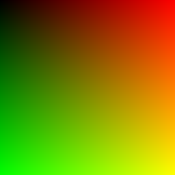

# Ray Dreams

### A Ray Tracer in Go, turning code and pixels into lights and dreams

### Following [Ray Tracing in One Weekend](https://raytracing.github.io/books/RayTracingInOneWeekend.html)

### WTF is a Ray Tracer to Begin  With

It's a technique that creates realistic 3D images by simulating the physical behavior of light,
tracing individual light as they interact with objects, bounce off surfaces, and change direction
through refraction and reflection.

In computer graphics it's used to produce highly detailed images with accurate shadows, reflections, and 
lighting, enhancing realism into games, films and virtual things!

### The Go Part

The Original book uses C++ as the language of choice to make this Ray Tracer. I'm
making it in Go, as it's my primary working language at the moment, and I've been also really enjoying to work with.
The name of the book says "In One Weekend". Let's see how long it takes me to do it.

### What is Going on?

Here is where I write about what is happening while I do it :)

##### What is PPM Image Format ??

The very first chapter talks about the PPM Image Format, because we need a way to see an image. However, I never heard of this format before. It stands for "Portable Pixel Map", it's simple, uncompressed raster image format designed for easy portability and manipulation across plataforms. It's part of the [Netbpm](https://en.wikipedia.org/wiki/Netpbm) Toolkit.

Why we are using it?

- For it's simplicity! no need for graphics library or special code to write it.
- We focus on the Ray Tracer instead of image formats
- Can be converted to PNG or whatever later.
- It's basically a little piece of text that describes image.

I just made my first image using Go:

Apparently, this is the "Hello, World" of computer graphics! and it's actually really cooL!
The image you seeing is a .png converted from the .ppm because Markdown can't display a ppm file, but still!

Ok now let's move to a more interesting question

### What is a RAY after all?

You can think of a Ray as:
- A **starting point** in a 3D space
- A **direction**, which way it's pointing
- A **parameter t** that tells you *how far along in that direction you've gone*

The Ray Formula:

`P(t) = A + t * b`

- `P(t)` -  The point you reach along the Ray.
- `A` - The Ray Origin
- `b` - The Ray Direction
- `t`- How far you go along that direction, in unit terms.

A visual way of thinking about: Imagine that you are standing at point **A**. Then you point a *flashlight* in direction **b**. So **t** is just a *slider* for how far the light is moving, for example `t = 0`, you are still at the origin `A`, `t = 1`, you've moved 1 unit in direction `b` and so on... it can also be negative `t = -1` meaning you are behind *origin*.

###### What a Ray Tracer does
In our case what the Ray Tracer does is:

1. Shoot a ray through each pixel
2. See what it **hits** in the scene.
3. Decide the pixel color based on that hit.

###### Setting up the image

- images have **aspect ratios** (width / height)
- example: 16:9 ratio, wider than tall. A image with 800px width and 400px height has a **2:1 aspect ration**
- We pick an image width of 400px. Then compute `height = width / aspect ratio`
- This keeps the pixel "square"

###### Viewport - The virtual screen in 3D space

- imagine a rectangle floating in front of the camera: that's the **viewport**
- each pixel corresponds to a point on this viewport
- We choose:
    - **viewport height = 2.0** - arbitrary start
    - **viewport width = scaled to match aspect ratio**
    - **focal length = 1.0** -> distance from camera viewport

###### Camera

Also known as "the eye point"

- Camera center = `(0,0,0)`
- Camera looks down **negative Z axis**
- X goes right, Y goes up(right-handed coordinates)

###### Pixel Grid

- Viewport edges are spanned by two vectors:
    - **viewport_u** -> horizontal direction
    - **viewport_v** -> vertical direction (points down since image Y increases downward)
- Pixel spacing -> `viewport_u / image_width, viewport_v / image_height`
- The very first pixel first(top left-corner, pixel00) is computed from the top-left of the viewport plus half a pixel offset.

###### Rendering Loop

For each pixel:
1. Compuite the center of that pixel on the viewport.
2. Build a **ray** from the camera center throught that pixel.
3. Ask `rayColor(rau)` what color to paint.
4. Write the color to the PPM file.

